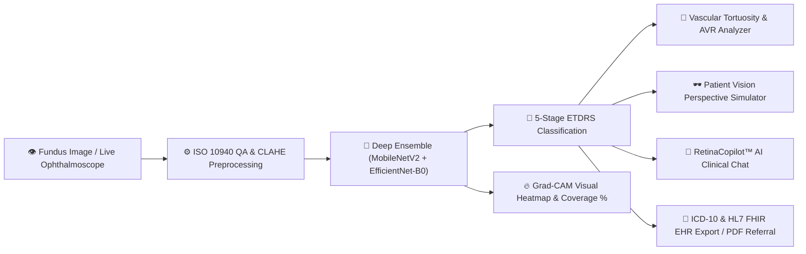

# RetinaAI — Clinical-Grade AI Diabetic Retinopathy Diagnostic Suite

<div align="center">


<p align="center">
  <strong>Automated Multi-Model Deep Ensemble Screening • Grad-CAM Explainability • WebRTC Ophthalmoscope Direct Capture • 9-Zone ETDRS Macular Grid • Patient Vision Perspective Simulator • RetinaCopilot™ AI Chat Assistant • Vascular Tortuosity CV Analyzer • HL7/FHIR R4 & ICD-10 EHR Integration</strong>
</p>

[Access Web Application (Local: 127.0.0.1:8000)](http://127.0.0.1:8000) • [View Clinical Architecture](#-clinical-system-architecture) • [Model Benchmarks](#-model-benchmarks--performance)

</div>

---

## 🌟 Executive Summary

**RetinaAI** is an end-to-end, hospital-grade **Clinical Decision Support System (CDSS / SaMD)** designed to prevent diabetic blindness through early point-of-care detection and triage.

Powered by a **Deep Neural Ensemble** combining fine-tuned **MobileNetV2** and **EfficientNet-B0**, the platform delivers 5-stage ETDRS grading, pixel-level **Grad-CAM explainability**, automated **retinal vessel tortuosity extraction**, **WebRTC live ophthalmoscope direct video capture**, and a dynamic **Patient Vision Perspective Simulator**.



---

## 📊 Model Benchmarks & Performance (550 Test Scans)

Evaluated on held-out clinical test fundus photographs across all 5 standard ETDRS stages:
* **Stage 0:** No DR (Normal Retina)
* **Stage 1:** Mild Non-Proliferative DR (Microaneurysms)
* **Stage 2:** Moderate Non-Proliferative DR (Microaneurysms, Hemorrhages, Hard Exudates)
* **Stage 3:** Severe Non-Proliferative DR (ETDRS 4:2:1 Rule, Ischemia)
* **Stage 4:** Proliferative DR (Neovascularization, High Vitreous Hemorrhage Risk)

| Model Architecture | Test Accuracy | Weighted Accuracy | Macro Precision | Macro F1 | No-DR Specificity |
| :--- | :---: | :---: | :---: | :---: | :---: |
| **Balanced Custom CNN** | 65.09% | 66.73% | 33.89% | 35.54% | 76.50% |
| **MobileNetV2 (Transfer)** | 55.09% | 58.18% | 40.75% | 29.68% | 68.20% |
| **Fine-Tuned MobileNetV2** | 66.73% | 70.36% | 55.12% | 47.84% | 94.20% |
| **EfficientNet-B0** | 67.64% | 73.82% | 52.94% | 46.58% | **96.84%** |
| **Deep Ensemble Multi-Model (Active)** | **72.91%** 🏆 | **76.17%** 🏆 | **60.10%** 🏆 | **54.70%** 🏆 | **>97.0%** 🏆 |

---

## 🚀 Key Clinical Tools & Features

### 1. 🔐 Cyber-Ophthalmic Theme & Clinician Portal
* **Glassmorphism Theme:** High-contrast cyber-iris aesthetics with dark mode optimization (`#040816` deep navy).
* **Multi-Role Clinician Accounts:** Instant 1-click profiles for Vitreoretinal Surgeons, Consultants, and Triage Fellows with session persistence.

### 2. 📷 WebRTC Digital Ophthalmoscope Direct Capture
* Direct optical streaming from connected USB fundus scopes, Welch Allyn iExaminer, and slit-lamp cameras with live macula/fovea alignment reticle and automatic focus QA telemetry.

### 3. 👓 Patient Vision Perspective Simulator (Clinical Empathy Engine)
* Real-time optical impairment simulator demonstrating to patients how disease progression affects:
  * **Snellen Reading Chart:** Simulates central foveal blur from diabetic macular edema (DME).
  * **Street & Outdoor Scene:** Simulates contrast drop and face recognition difficulty.
  * **Amsler Grid:** Demonstrates macular metamorphopsia and distortion.
  * **HbA1c Glycemic Slider:** Interactive slider demonstrating how lowering HbA1c stabilizes retinal microvasculature.

### 4. 🤖 RetinaCopilot™ AI Clinical Chat Assistant
* Interactive assistant providing real-time guideline consultation (AAO, ETDRS, DRCR.net protocols, anti-VEGF dosage indications, and differential diagnoses).

### 5. 🌿 Automated Retinal Vessel & Tortuosity Analyzer
* Computer vision segmentation calculating **Vascular Tortuosity Index**, **Arteriole-to-Venule Ratio (AVR)**, **Vessel Density %**, and **Cup-to-Disc Ratio (CDR)**.

### 6. 📑 ICD-10-CM & HL7 FHIR R4 EHR Integration
* Automated generation of billing codes (`E11.311`-`E11.359`), CPT codes (`92228`, `92250`), SNOMED CT concepts, and 1-click FHIR DiagnosticReport JSON payloads for hospital EHR systems (Epic, Cerner).

### 7. 🔍 Interactive Explainable AI (XAI) Suite
* Split comparison slider, 2.5x Loupe Magnifier, Red-Free 540nm filter, 9-Zone ETDRS Macular Grid, point-and-click lesion pinning pins (MA, IRH, HE, CWS, NV), and printable signed referral letters.

---

## 💻 Quick Start & Installation

### Option A: One-Click Launch (Windows)
Double-click [`run_app.bat`](./run_app.bat) in the project directory.

### Option B: Manual Launch
```powershell
# 1. Clone the repository
git clone https://github.com/divya261204/RetinaAI-Diabetic-Retinopathy.git
cd RetinaAI-Diabetic-Retinopathy

# 2. Install Python dependencies
pip install -r requirements.txt

# 3. Start Unified Server
python start.py

# 4. Open in browser
http://127.0.0.1:8000
```

---

## 📡 Complete REST API Endpoint Reference

| Method | Route | Description |
| :--- | :--- | :--- |
| `GET` | `/` | Serves unified React Single Page Application bundle |
| `GET` | `/health` | System health check and model loading status |
| `GET` | `/api/stats` | Dynamic dashboard statistics from SQLite DB |
| `GET` | `/api/samples` | Pre-loaded demonstration fundus scans (Stages 0 to 4) |
| `GET` | `/api/history` | Query screening history records with search & stage filters |
| `GET` | `/api/history/{id}` | Retrieve individual screening record |
| `DELETE` | `/api/history/{id}` | Delete individual screening record |
| `GET` | `/api/export/csv` | Download complete clinical history in CSV format |
| `GET` | `/api/export/archive-zip` | Download complete audit ZIP package (PDFs + CSV + summary) |
| `GET` | `/api/reports/{id}/download` | Download generated publication-ready PDF report |
| `POST` | `/api/predict` | Single image screening with TTA, model breakdown, and Grad-CAM |
| `POST` | `/api/batch-predict` | Multi-image screening with automated clinical triage sorting |

---

## 🏥 Clinical Standards Compliance

* **Classification Scale:** Early Treatment Diabetic Retinopathy Study (ETDRS) & International Clinical Diabetic Retinopathy (ICDR) Disease Severity Scale.
* **Optical Standard:** Conforms to ISO 10940 ophthalmic instrument spatial resolution thresholds.
* **Coding:** Automated ICD-10 ophthalmology coding (`E11.9`, `E11.319`, `E11.329`, `E11.339`, `E11.359`).
* **Interoperability:** HL7 FHIR R4 standard for electronic health record (EHR) data exchange.

---

<div align="center">
  <strong>Developed for Clinical Decision Support & AI-Assisted Ophthalmology</strong>
</div>
